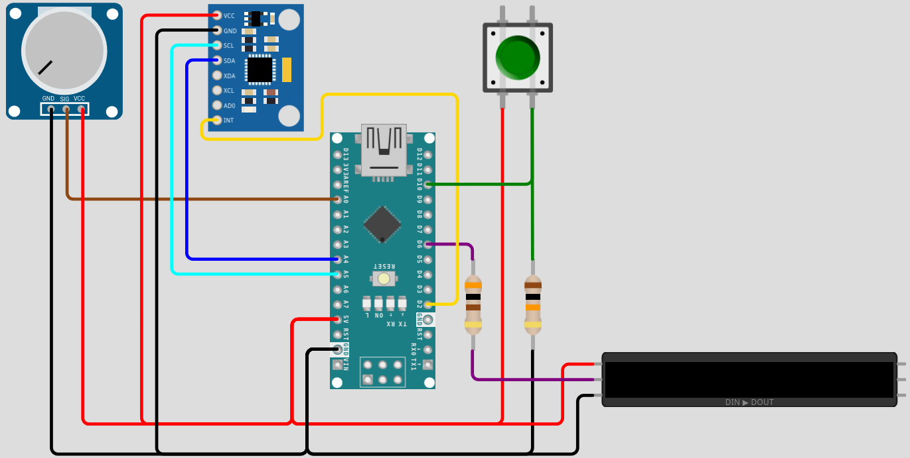

# Compass Lantern

> Arduino compass lantern: IMU-driven LED ring always illuminates the same absolute direction.

A lantern that uses an IMU (Inertial Measurement Unit) to track its own orientation and drives a circular LED strip such that the illuminated segment always points in the same absolute direction — like a compass needle made of light. Rotate the lantern casing however you like; the glowing arc stays fixed in space.

---

## How It Works

An IMU (MPU-6050) continuously measures the lantern's yaw angle relative to its starting orientation. The Arduino uses this heading data to calculate which LEDs on the ring need to be lit so that the illuminated point always faces the same world direction. As the lantern is rotated, the active LEDs shift around the ring to compensate, keeping the light "locked" to a fixed bearing.

---

## Hardware

| Component | Example Part | Notes |
|---|---|---|
| Microcontroller | Arduino Nano / Uno | Both use the same pins for communication protocols (e.g. I2C with IMU). |
| IMU | MPU-6050 *or*   BNO055 | Currently used by implementation (6-axis).   Can read magnetic field for absolute orientation (9-axis). |
| LED Strip | WS2812B stripe | NeoPixel-compatible |

### Wiring

### Possible optimizations
- Do not source the LED stripe's Vcc from the Arduino but use a seperate source to enable larger ampere supply. This would also prevent the Arduino from heating up due to a high amount of current running through its power regulator.
- Use a 1000 µF / 6.3 V capacitor connected to Vcc and GND of LED ground to prevent surges in power supply.
---

## Software

### Dependencies

Using PlatformIO should install all used libraries automatically.

---

